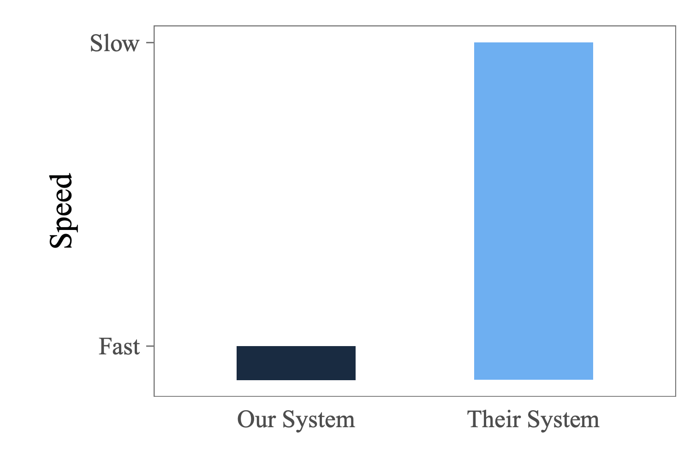

import Sidenote from '../../components/Sidenote.astro'
import HoverCard from '../../components/HoverCard.astro'

Benchmarking is hard.

We believe our `waycast` gateway is the fastest AI gateway around. We believe
this because its written in Rust<Sidenote>And therefore blazing
fast</Sidenote>, and because we thought about performance a lot while we were
building it. We put it in production in our self-hosted inference stack, and we
knew that it was fast because we didn't notice it.

But we're open sourcing it. And once its open source, it can be used in lots of
different places, with lots of different performance profiles. And so, to prove
to ourselves that it will be fast everywhere, we have to do benchmarking.

But benchmarking is hard. The only realistic benchmarks are built by you, the
user, since only you know what your application looks like<Sidenote>Every
highly technical business for whom performance is a proof point eventually
releases a weary blog post talking about how performance is multifaceted and
can't be captured by simple benchmarks. See
[here](https://planetscale.com/benchmarks),
[here](https://motherduck.com/blog/perf-is-not-enough/),
[here](https://hannes.muehleisen.org/publications/DBTEST2018-performance-testing.pdf),
[here](https://blog.tjll.net/reverse-proxy-hot-dog-eating-contest-caddy-vs-nginx/)
for interesting content.</Sidenote>. Still, we have to try.

<Sidenote unnumbered>
 Fig. 1: How this article is going to go. From
 [this](https://hannes.muehleisen.org/publications/DBTEST2018-performance-testing.pdf)
 article on benchmarking in DBMS.
</Sidenote>

## What are we benchmarking

`waycast` is an "AI Gateway". For the purposes of this discussion, this is
basically a [reverse
proxy](https://www.cloudflare.com/en-gb/learning/cdn/glossary/reverse-proxy/)
that is specialised to openAI compatible requests. From our perspective, there
are a few essential features:

1. **Authentication**. OpenAI standardised bearer token authentication for AI
   APIs, and it works great. AI gateways let you centralise auth in one place,
   across multiple providers. They also let you authenticate unauthenticated
   endpoints - like self-hosted LLMs, deployed in [vllm](https://github.com/vllm-project/vllm), [sglang](https://github.com/sgl-project/sglang), [ollama](https://ollama.com/), [doubleword](https://github.com/doublewordai/inference-stack)

2. **Self-hostable**. From a usability, privacy and security perspective - we
   aren't willing to let a cloud hosted gateway man-in-the-middle all of our
   requests to AI providers, and I don't think you should be either. Purely
   selfishly, since i'm benchmarking these things, I don't want to deal with
   network hops, and trying to figure out where gateway providers have deployed
   their infra to try and benchmark them fairly.

3. **Easy to use**. Again partly selfish. But I haven't got forever for this,
   and I want to be comprehensive. So if I couldn't get the product up and
   running in a production-like configuration within 30 minutes, I dropped it.

Here's a list of options:

<Sidenote unnumbered>
 Note: this table will probably go out of date almost instantly. I'll try my
 best to keep it up to date, but i'll also link where i got the info so you can
 check if its all still true.   
    Hosted offerings: [Requesty](https://www.requesty.ai/),
 [Openrouter](https://openrouter.ai/),
 [TrueFoundry](https://www.truefoundry.com/ai-gateway), [Cloudflare AI
 gateway](https://www.cloudflare.com/en-gb/developer-platform/products/ai-gateway/),
 [Vercel AI gateway](https://vercel.com/docs/ai-gateway){' '}
</Sidenote>

| Who                                                    | Auth | Hostable | Easy | Vibes                                                                                                                                                                                                                                                                                                                                                                                                                                                                                                                                                                                                                                                                                                                                                                                                                                                                                                                                         |
| ------------------------------------------------------ | ---- | -------- | ---- | --------------------------------------------------------------------------------------------------------------------------------------------------------------------------------------------------------------------------------------------------------------------------------------------------------------------------------------------------------------------------------------------------------------------------------------------------------------------------------------------------------------------------------------------------------------------------------------------------------------------------------------------------------------------------------------------------------------------------------------------------------------------------------------------------------------------------------------------------------------------------------------------------------------------------------------------- |
| [LiteLLM](https://www.litellm.ai/)                     | ✓    | ✓        | ✓    | Probably the first to outline exactly this product (or at least the first I heard of). Written in python. [Loads](https://docs.litellm.ai/docs/) of features.                                                                                                                                                                                                                                                                                                                                                                                                                                                                                                                                                                                                                                                                                                                                                                                 |
| [Bifrost](https://github.com/maximhq/bifrost)          | ✓    | ✓        | ✓    | Claims to be the [fastest](https://github.com/maximhq/bifrost) LLM gateway. Nice UI. Written in go.                                                                                                                                                                                                                                                                                                                                                                                                                                                                                                                                                                                                                                                                                                                                                                                                                                           |
| [Helicone](https://github.com/Helicone/helicone)       | ✓    | ✓        | ✓    | TODO: benchmark this one                                                                                                                                                                                                                                                                                                                                                                                                                                                                                                                                                                                                                                                                                                                                                                                                                                                                                                                      |
| [Tensorzero](https://github.com/tensorzero/tensorzero) | ✗    | ✓        | ✓    | No authentication story. <HoverCard>Super interesting project, with a lot to offer on the experimentation & evaluation side. Also written in Rust, and with strong benchmarks. I'd like to benchmark it anyway, but auth is a hard requirement for us, and auth vs. no auth is apples to oranges.</HoverCard>                                                                                                                                                                                                                                                                                                                                                                                                                                                                                                                                                                                                                                 |
| [Kong](https://portkey.ai/)                            | ✓    | ✓        | ✗    | Couldn't get it running <HoverCard>A product from a company that built enterprise gateways back before AI was all the rage. Getting their core gateway product up and running is really easy, and from what I know of it in that context, its performant and nice to use. But I couldn't get the AI offering working in a reasonable amount of time In order to make it an AI gateway I have to run some sort of shell piped bash script? And then that will transform my running regular Kong gateway into an AI gateway? Either way i tried it and it didn't work. I'd like to come back to this one though. </HoverCard>                                                                                                                                                                                                                                                                                                                   |
| [Portkey](https://portkey.ai/)                         | ✓    | ✗        | ✗    | The hosted offering looks really [nice](https://portkey.ai/). But their OSS version is missing lots of features [^3] <HoverCard> They make a very visible claim that their product is open source, and as far as I can tell that's not accurate. They have an open source [offering](https://github.com/portkey-ai/gateway), but if you actually try to use it, you find that their [core features](https://github.com/portkey-ai/gateway?tab=readme-ov-file#core-features) list is a list of features that are available in their hosted product. And all the documentation links are to that product. From what i can tell from trying to use the OSS version, I can't actually use authentication. I gave them a cross for "easy to use" since it took me more than 30 minutes of looking to figure out that I couldn't do auth in the OSS product, which was very frustrating. If i'm wrong here, i'm happy to be corrected. </HoverCard> |

These are all the offerings that I could find that met our requirements (and
lots that don't). If you know of another that i've missed out, let me know
[here](mailto:hello@doubleword.ai)

So the candidates are:

1. **[LiteLLM](https://litellm.ai)**: Python, feature complete
2. **[Bifrost](https://https://github.com/maximhq/bifrost)**: Go, more minimal
3. **[Waycast](https://github.com/doublewordai/waycast)**: Rust, even more minimal (for now).

## How to benchmark a proxy

Benchmarking reverse proxies in general is pretty difficult. We're low level
enough that the details of the hardware and the network really matter, but high
level enough that they're easy to forget about<Sidenote>Another call to do your
own benchmarking, where a system doing well because you made peculiar
hardware choices is actually a good thing.</Sidenote>.

At the highest level, we need:

1. Something that sends traffic (A source)
2. Somewhere to deploy our proxy
3. Something that receives traffic, and returns responses (A sink)

You can put all this stuff on the same host, but then the benchmarking
apparatus will interfere with your proxy. Really they should be on separate
machines. All the details of how we do this (via a terraform plan) are
[here](https://github.com/doublewordai/benchmark).

The sink is a simple openAI compatible server, built with rust's axum library.
It implements two endpoints (`/v1/models/`) which advertises the existence of a
single model (called benchmark-model), and `/v1/chat/completions`, which accepts
chat completion requests, and responds with a canned response.

The source of load is a similarly simple HTTP load tester. It spawns $N$
workers, each of which pull requests from a shared queue of fixed initial size,
and send them on, concurrently, until the queue is exhausted. Think
[locust](https://locust.io/), [k6](https://k6.io/). We expose a REST API to
trigger benchmarks via POST requests, and a simple HTTP frontend to drive the
API.

The source and the sink run together in the same binary<Sidenote>Code
[here](https://github.com/doublewordai/benchmark/tree/main/server)</Sidenote>.
For isolation purposes, we can use a separate source deployment from the sink
deployment, by just deploying this binary in two different places, which we do,
although this is probably unnecessary. To get a rough sense of the overhead of
our setup here, we also benchmark the straight path from the source to the
sink.

### Hardware

We'll use pretty minimal hardware for a few reasons:

1. I suspect LiteLLM will be slower, for various reasons. Since its written in
   python, and therefore has the
   [GIL](https://en.wikipedia.org/wiki/Global_interpreter_lock) to contend with, I
   don't want to hamper it unnecessarily. This hamstrings the offerings that could
   make use of multiple cores (i.e. all of the other ones), but as we'll see,
   they'll win so handily it doesn't matter too much. Consider this just another
   point in favour of proxies that can do real multithreading.
2. We're benchmarking the performance of a single instance of each proxy. In
   practise, we can easily horizontally scale them as much as we want. But
   scaling from "1" to "more than 1" adds a disproportionate amount of complexity
   vs. the other scaling thresholds. Also, the less load each individual instance
   can handle, the more it costs you in production, and the more likely you run
   into performance problems (i.e. high tail latency while scaling new instances)

We use GCP's "e2-medium" instances for all three components: the source, the
system under test, and the sink.

### Load

What's a realistic scenario for a AI gateway? As with everything, it depends.
There are lots of parameters we might tune:

- **Number of workers**: the number of concurrent requests that can be sent at
  any one time - i.e. a proxy for the number of concurrent users the system can
  support.
- **Total number of requests**: the total number of requests we work through in
  the benchmark. Determines how long the benchmark runs for, and therefore the
  stability of the results, but not much else (as long as its above 1.).
- **The request size**: the size of the request payload. This is a proxy for
  the size of the prompt. Larger request prompts will (in principle) create more
  work for the proxy to do. Whether that work is mostly IO or compute depends on
  the proxy implementation.
- **The amount of time the mocked sink waits between requests:** This lets use
  tune between IO bound (lots of concurrent connections, where the proxy mostly
  waits for stuff to happen) to compute bound (the proxy is mostly busy doing
  stuff) regimes.

### Configuring the servers

We leave request logging enabled on all the servers, since the docs for each
say that it doesn't cause overhead. We set logging to the info level. As far as
possible, (and where they exist), we follow the production guides for each
server.

## Results

### First benchmark: 100 concurrent users, 1KB request sizes, wait: 0.5s

Lets start with a simple one: 100 concurrent users, 1KB<Sidenote>Pretty small,
since most tokenizers are ~3 tokens per character, this is ~300
tokens.</Sidenote> request sizes. The upstream server responds pretty
quickly: 0.5s, the idea is to strike a balance between streaming responses
(which will return much more frequently than this) and non-streaming (which
will return much less frequently)<Sidenote>Really we should model both. But how
many of each? This is why we should run our own benchmarks.</Sidenote>.

The theoretical maximum throughput is 200 requests per second, since each
request must wait 0.5s to be processed, and we have 100 concurrent workers.

The baseline is the performance of the load being driven directly at the sink,
so shows the overhead of the load generator itself, the time spent in the sink
that's not accounted for in the wait time, and the network overhead <Sidenote>In principle not all the overhead, since there's a network hop missing.</Sidenote>

We can see that, at 100 concurrent users, waycast keeps up very well. The overhead
stays in sight of the baseline, even at higher percentiles. Bifrost adds more
overhead than waycast but still performs reasonably. LiteLLM on the other hand,
falls well behind \- with over a full second of latency being added to the
median request.

| Metric           | Theoretical | Baseline | waycast    | Bifrost | LiteLLM |
| :--------------- | :---------- | :------- | :--------- | :------ | :------ |
| Requests/sec     | 200.00      | 197.64   | **179.72** | 154.09  | 59.29   |
| Avg Latency (ms) | 500         | 504      | **549**    | 603     | 1613    |
| P50 Latency (ms) | 500         | 502      | **504**    | 577     | 1402    |
| P90 Latency (ms) | 500         | 510      | **594**    | 734     | 2599    |
| P99 Latency (ms) | 500         | 527      | **892**    | 908     | 3137    |

### Faster upstream: 100 users, 1KB request sizes, wait: 0.1s

Driving down the wait time increases the theoretical maximum throughput, since
we don't need to wait around. It increases the work the proxy has to do, since
its being hit from both sides \- responses come back quick, and requests come
in quick. If you use a lot of fast models, this might be a realistic scenario.

The baseline starts to fall behind the theoretical numbers, and waycast starts
to fall behind the baseline. The latency is still likely imperceptible, even at
the tail, but not by much, and adding network latency will take it over the
edge.

Bifrost starts to struggle significantly at this load level, with much higher
latency. LiteLLM continues to struggle even more, with a median latency of over
1.6s.

| Metric           | Theoretical | Baseline | waycast    | Bifrost | LiteLLM |
| :--------------- | :---------- | :------- | :--------- | :------ | :------ |
| Requests/sec     | 1000.00     | 964.76   | **832.55** | 160.28  | 54.41   |
| Avg Latency (ms) | 100         | 103      | **113**    | 558     | 1714    |
| P50 Latency (ms) | 100         | 102      | **110**    | 489     | 1669    |
| P90 Latency (ms) | 100         | 104      | **131**    | 975     | 1978    |
| P99 Latency (ms) | 100         | 106      | **154**    | 1362    | 2659    |

### Backing off: 50 concurrent users, 1KB request sizes, wait: 2.0s

Lets try lower load - half the users, and slower LLMs.

At low load, the only effect of the proxy should be a minor increase in
latency. For both waycast and Bifrost, this is the case \- they're almost
indistinguishable from the baseline, with Bifrost performing slightly better on
throughput and average latency, while waycast is better at P50 and P90. I'd
suspect we had some random blip here for waycast that's increasing the tail
latency, but I don't want to get into redoing experiments, since it seems like
an obvious way that bias would slip in.

LiteLLM adds almost 200ms of latency on average, and over 2 seconds at the tail.

| Metric           | Theoretical | Baseline | waycast  | Bifrost   | LiteLLM |
| :--------------- | :---------- | :------- | :------- | :-------- | :------ |
| Requests/sec     | 25.00       | 24.96    | 24.78    | **24.80** | 22.47   |
| Avg Latency (ms) | 2000        | 2002     | 2017     | **2009**  | 2186    |
| P50 Latency (ms) | 2000        | 2002     | **2003** | 2005      | 2059    |
| P90 Latency (ms) | 2000        | 2004     | **2007** | 2024      | 2179    |
| P99 Latency (ms) | 2000        | 2006     | 2259     | **2045**  | 4431    |

## What to take away

From these simple benchmarks, we can see that:

- **waycast** performs best overall, with the lowest overhead across most
  scenarios. It keeps up well even under high load (100 concurrent users).
- **Bifrost** performs well at low load, matching waycast's performance.
  However, it struggles significantly under high load, showing
  much higher latency than waycast.
- **LiteLLM** struggles to keep up with even moderate load, adding dramatic
  latency across all scenarios. At 100 concurrent users, it adds over 1 second of
  latency to median requests.

### Why do we care?

There's an argument that goes: why do I care if my proxy is fast? It's not the
slowest part of my system - that's almost certainly the LLM. To which - fair.
This isn't LLM inference optimization<Sidenote>If you care about that sort of stuff, see [here](https://fergus.finn@github.io/blog/scheduling-in-inference-engines/), [here](http://localhost:4321/blog/llm-guided-scheduling/), [here](http://localhost:4321/blog/spacelike-speculative-decoding/), [here](https://docs.doubleword.ai/conceptual/10-06-2025-bts-2)</Sidenote>, where you're working on systems that are
painfully slow, and where if they were 10 times faster you could change the
whole world.

The reason is that performance doesn't only matter when its currently a
bottleneck. Everything to do with LLMs changes every day. The systems we build
could become a bottleneck tomorrow. If gateways show their promise, they'll be
in front of every single request that gets sent to every single AI provider.
Those systems will get faster - they'll send more data, serve more users, and
return more tokens more quickly. When they do, if we've left 10x performance on
the table, we'll feel it immediately, and painfully.

Besides, the best possible thing that this part of the stack can do is
disappear. It's like the referee in a football game - if the viewer notices
them, then their doing a bad job. If API consumers notice that they're being
served behind a reverse proxy, then the proxy is doing a bad job. Even small
performance improvements can help us to disappear.

If you'd like to get started with waycast, join us on the
[github](https://github.com/doublewordai/waycast). For issues, with our
performance or my benchmarking methodology, raise them on the [issues
page](https://github.com/doublewordai/waycast/issues).
