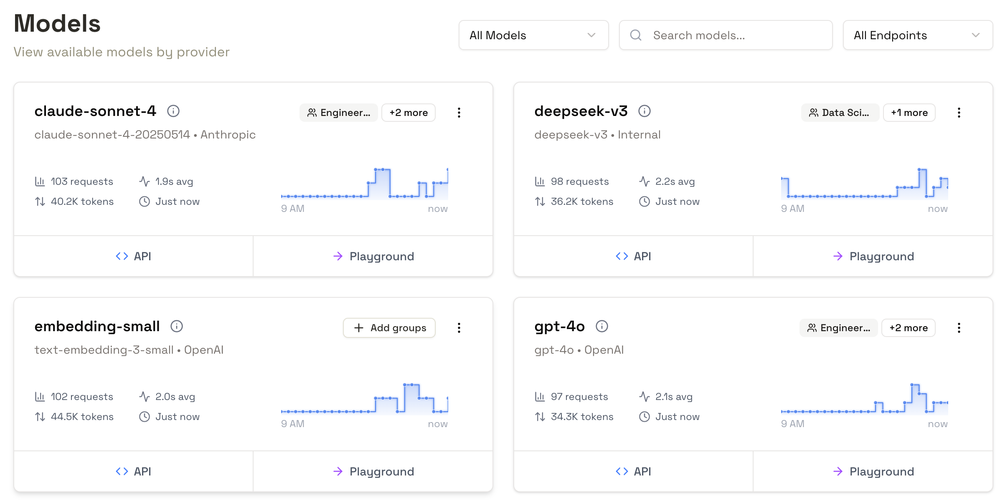
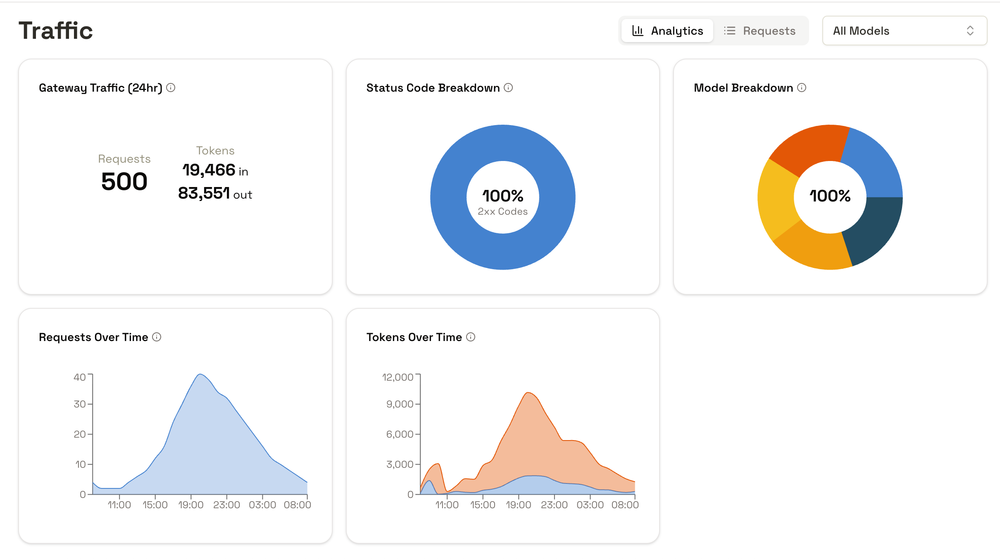
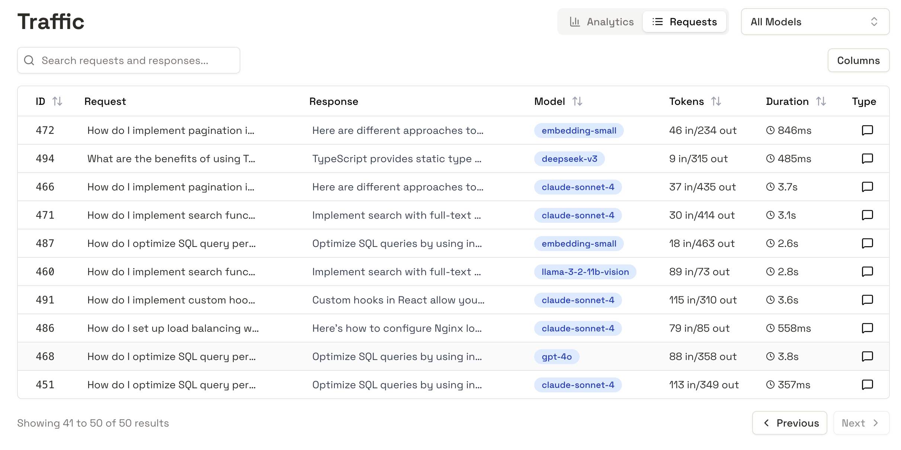
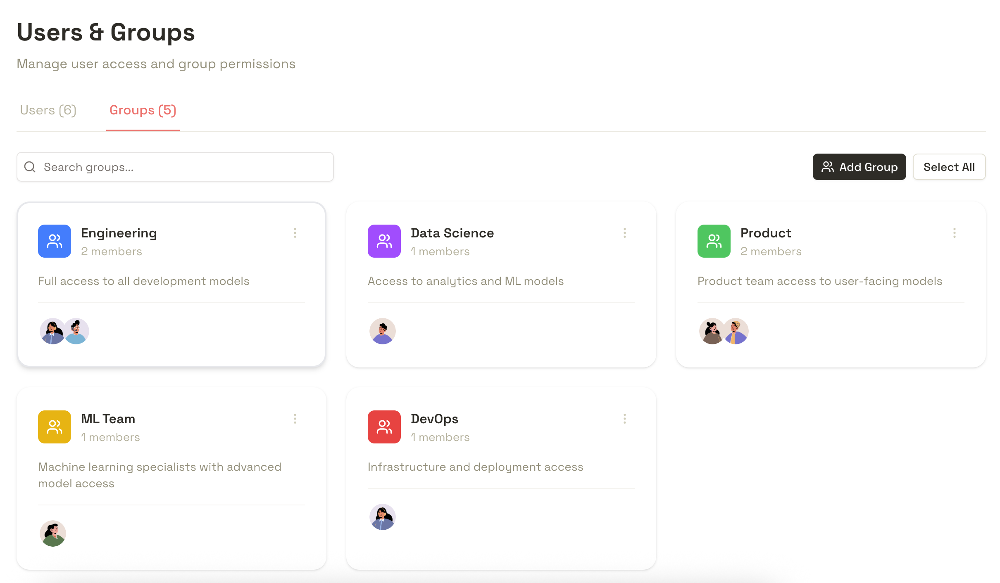

import Sidenote from '../../components/Sidenote.astro'

There's an emerging category of product in vogue at the moment, mostly designed for
teams using LLM APIs. It's usually called an LLM Gateway, or an AI Gateway<Sidenote>[here](https://www.litellm.ai/),
[here](https://konghq.com/en-gb/products/kong-ai-gateway),
[here](https://vercel.com/docs/ai-gateway),
[here](https://developers.cloudflare.com/ai-gateway/), [here](https://portkey.ai/) </Sidenote>, or something like that.

At [Doubleword](https://doubleword.ai) we're releasing our [control
layer](https://www.doubleword.ai/control-layer), another product in this
category. I want to talk about why you'd need this, what I think you should
value when choosing a gateway, and why we think we do it well.

## The case for AI Gateways

### How LLM application building has changed

The way to produce intelligence that was tailored to your use-case before LLMs
ate everything was that you'd store, manage and maintain a massive trove of
data. Then a team of expensive data scientists would run an algorithm to encode
all that data into a 'model', a complex and fairly inflexible artefact, that
you'd then deploy to provide the same sort of insight over and over again.

With LLMs its changed a bit. LLMs when scaled up do seem to produce 'general
purpose intelligence' in some sort of controversial but meaningful way. A lot
of what would require lots of specialization before just doesn't any more. On
the other hand, the incentives for the companies that do provide these large
models to flatten the whole space into one big prompt to their preferred model
means that the advice for how to build interesting AI applications is
suspiciously one-note.

In general, we haven't found the right balance here. Building your own model
from your data from scratch is too much, but writing your prompt once and
sending it to openAI is too little.

### How to specialise in an age of generalist models

In practise, to build a good application with some level of specialisation,
you're going to have to do some 'fine-tuning' - in the original sense, meaning
turning your application's behaviour to your desired end.

As I see it, there are three different levels you might go through, in
increasing levels of difficulty:

1. Modifying your system prompt (inc. context engineering, etc.)
2. Picking the best model amongst a set of providers.
3. Building a model that's meaningfully your own, and hosting it efficiently.

I work for [Doubleword](https://www.doubleword.ai/), a company that works on
making point 3 possible. In the long run, for applications where you want the
highest performance, the deepest integration, and the most control, this is the
right way to operate. This is what we've been calling [InferenceOps](https://www.doubleword.ai/resources/what-is-inferenceops-defining-the-function-behind-scalable-ai).

But that's not all applications. All applications have to start somewhere, and
for most people, it shouldn't be with buying a rack of
[B200](https://www.nvidia.com/en-gb/data-center/dgx-b200/)s. So we're going to
end up using APIs.

### Why AI gateways

API models are frustrating for a lot of different reasons. Most of them boil
down to the same thing - someone else is managing them.
It means that they can be unreliable without
[accountability](https://www.anthropic.com/engineering/a-postmortem-of-three-recent-issues),
that they can
[deprecate](https://www.doubleword.ai/resources/shifting-sands-openais-fluctuating-model-performance-and-the-impact-on-developers)
models that you were relying on, you don't get privacy, data residency, or
tenancy
[guarantees](https://www.doubleword.ai/resources/genai-in-regulated-industries).

The dream of self-hosting is that you can own your own stack - that you can
have more control over your operations, and not fail because someone else did a
bad job.

The control layer is our way to help people get some of these benefits from API
models.

## Anatomy of an AI Gateway

AI gateways sit between your users and LLM APIs. Where your developers would
call the openAI API, they instead call an internal API that you make
available.

```txt
       ┌─────────────┐  ┌─────────────┐
       │   OpenAI    │  │ Anthropic   │
       └─────────────┘  └─────────────┘
              ▲               ▲
              │               │
            ┌─────────────────┼───────────────────────┐
            │ │               │   ┌───────────────┐   │
            │ │               │   │               │   │
            │ │               │   │  self-hosted  │   │
            │ │               │   │    models     │   │
            │ │               │   │               │   │
            │ │               │   └───────────────┘   │
            │ │               │            ▲          │
            │ └───────────────┼────────────┘          │
            │                 │                       │
            │         ┌───────────────┐               │
            │         │   AI Gateway  │               │
            │         └───────────────┘               │
            │                 ▲                       │
            │                 │                       │
            │          ┌──────────────┐               │
            │          │    Users     │               │
            │          └──────────────┘               │
            └─────────────────────────────────────────┘

```

Beneath the hood, the service you've configured at that internal API receives
the request from that developer and sends it where it needs to go.

It's not a big change in infrastructure, but it does some big things:

1. It lets you understand and build on your teams usage of AI in real-time.
2. It lets you make decisions about how data flows to and from AI models.
3. If you do it wrong, it creates a single point of failure, and slows down every request you make.

### Understanding AI usage

#### Seeing what's happening

The control layer gives you a single pane of glass in which you can see your
how everyone in your organization is using AI.

This is very powerful. AI is expensive and hard to get right. If you want
to get better, you have to know what you're doing now <Sidenote>https://arxiv.org/pdf/2007.03488</Sidenote>.

But this is hard now. Telemetry helps, but its like looking through frosted
glass - the tools we have are designed to do everything. Since every
interaction with a model is an API call - we can see everything that matters by
intercepting and forwarding these API calls. We don't spend days building
dashboards that nobody looks at. There's _alignment_ between the goals of your
users and the things that you're monitoring - they use the system by making API
calls, and you're looking at the API calls.

<Sidenote unnumbered>
 The models page in the Doubleword Control layer. At a glance, you can see all
 the models you've configured for your downstream applications to use, and high
 level metrics on how they're being used.

API examples make it easy to help your application teams integrate, and the
built in playground gives you an interactive place for vibe-testing and
sense-checking.

</Sidenote>


#### Building a flywheel

Once you've built a mature, usable application that works in production and
your users rely on, then the real work starts. How do you make it better? The
path from here to there is fuzzy and fraught with dangers.

One thing everyone agrees on is that you need data. Data on how your system is
being used, data on how fast its running, and, if at all possible, the full kitchen
sink - every request and response that your application is sending.

We built in this functionality, at the level of granularity that you need.
Full-featured RBAC means that sensitive data is only visible to users with the
required permissions, and configurable logging means that you don't store what
you don't want.

<Sidenote unnumbered>
 High level analytics, visible to users who manage the platform, to understand
 when, how, and how effectively your users are using AI.
</Sidenote>


<Sidenote unnumbered>
 Full storage of every request that transits the control layer. Full requests
 are only viewable by users with the right permissions, and filters for
 deciding what requests to store can be set in configuration.
</Sidenote>


#### Gating access

The control layer lets you flexibly and transparently decide to whom models are
available. We keep your 'downstream'<Sidenote>i.e. the ones that you get from
openAI, Anthropic, etc.</Sidenote> API keys encrypted in the database, and
your users issue 'virtual keys' that they use to access the models to which
your team has granted them access.



### Why its easy to do badly

Infrastructure is hard. An AI gateway will sit in the hot path of every single
request your organization makes to an AI model. This could be hundreds of
thousands of requests per second. If the gateway goes down, you can be cut off
completely.

That makes a few things absolutely paramount:

#### Reliability

We built our control layer in Rust. Rust's error modelling means that runtime
panics are incredibly rare.

We maintain 100% test coverage of every code path that's exercised along the
path of an AI request.

We make sure that we do as little as possible with each request. The less the
gateway does, the less can go wrong.

#### Performance

Gateways are classic examples of IO bound applications. The intuition is that
this is the kind of place where you can get away with an interpreted language &
an event loop. There's some truth to this. But there's a philosophy mismatch.
Gateways are the simplest possible web applications. This simplicity &
flexibility means that they get hit with massive load. Performance is something
you need to put in as a keystone of your design - you can't put it back in
later.

Our API key implementation requires no database round trip - instead, a
materialized in memory cache of API keys validates incoming requests in
real-time<Sidenote>This also means we don't make compromises on revocation - as
you might if you used JWTs for example.</Sidenote>. This also means we don't
have the operational overhead of deploying an additional caching layer - like
Redis, etc.

Requests that transit the gateway are not deserialized. Instead, we use
`serde`'s zero-copy implementation to read the 'model' field in incoming JSON
bodies, and then route the request at the HTTP level, without needing to parse
incoming or outgoing requests. This also makes the system substantially easier
to debug - you get the confidence that the errors your users receive are coming
from downstream applications, and are not being wrapped or transformed by your
proxy<Sidenote> If we don't parse the requests, how do we log them in a
structured way? We built the [outlet](https://crates.io/crates/outlet) rust
crate for asynchronous logging of requests. The requests are relayed to a
background thread as raw bytes, and then the background thread parses and
stores them as structured data. Only
[outlet-postgres](https://crates.io/crates/outlet-postgres) is implemented for now, but other outlets are on the roadmap. </Sidenote>.

####  Simplicity

The entire system runs as a single binary that talks to a Postgres database. We
don't have a million features, and we don't intend to. A gateway should be
infrastructure, in the same way that [nginx](https://nginx.org) is infrastructure.

## Outlook

Directly building on third-party LLM APIs is a trade-off: you gain initial
speed, but sacrifice long-term control. For any serious application, that
trade-off eventually breaks down. The instability of shifting models,
unpredictable performance, and opaque usage data is not a viable foundation
for production systems.

An AI gateway is the correct architectural response. But adding a new service
to the hot path of every request is a decision that can't be taken lightly. A
gateway that isn't fundamentally performant and reliable ceases to be a
solution and becomes part of the problem, compromising the very applications
it's meant to support. It must be treated as core infrastructure.

We built the Control Layer to be that infrastructure. The design choices - a
single binary in Rust, zero-copy request handling, and an obsession with
simplicity - are a direct response to the challenges of building a gateway
correctly. We intend to make it a solid foundation for providing the control
and observability that professional AI development requires.

This is the first step towards a mature InferenceOps practice. It's about
moving beyond one-off API calls and building a deliberate, robust system for
deploying intelligence.
