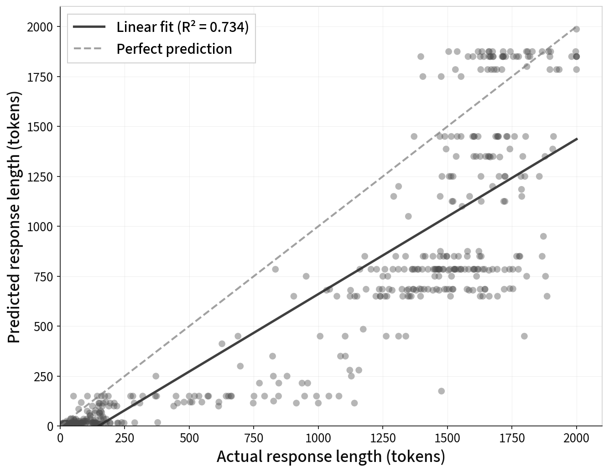

import Sidenote from '../../components/Sidenote.astro'

I talked a bit [here](/blog/scheduling-in-inference-engines) about how we do
scheduling in inference engines.

I wanted to continue with some thoughts on how we can use the structure of the
problem to make scheduling easier. First, I'll

## Scheduling in operating systems

> And you have to realize that there are not very many things that have aged
> as well as the scheduler. Which is just another proof that scheduling is
> easy. <Sidenote> L. Torvalds. The Linux Kernel Mailing List. [here](http://tech-insider.org/linux/research/2001/1215.html), Feb. 2001. </Sidenote>

The scheduling problem in LLM inference engines is analogous to a problem that
people wrestle with in operating system design: thread scheduling. Users want
to run many processes at once, but they only have a fixed set of processor
cores. we try to run the processes on those core in a 'time-sliced' fashion,
such that each process in the system can progress.

The goals are:

1. **Fairness**: No user should be systematically advantaged over another
2. **Throughput**: As many processes should run to completion (per unit time)
   as possible
3. **Interactivity**: The 'waiting time' per process should be minimized - the
   time a user waits between a processes 'available' states should be low.

Different systems will trade off these properties in different ways - laptops
and phones need to be highly available, batch processing systems might maximise
throughput.

There are a few different algorithms that are proposed.

## A whistle-stop tour of scheduling algorithms

### First come first served (FCFS)

Each process joins a queue. The scheduler picks the first process in the queue,
and runs it to completion. It then picks the next process in the queue, and
runs it to completion. And so on, and so on.<Sidenote>This is how we do it in LLM inference [currently](/blog/scheduling-in-inference-engines) </Sidenote>

```
  ┌────────────────────────────────────┐
  │ T: 0            4    7    9        │
  ├────────────────────────────────────┤
  │    │      T1    │ T2 │ T3 │   T4   │
  │     ████████████                   │
  │                 █████              │
  │                      █████         │
  │                           █████████│
  └────────────────────────────────────┘
```

### Round robin

Pick a time "quantum". Preempt the running process in favour of the next in the
running set every time a clock with that duration ticks.

```txt
  ┌──────────────────────────────┐
  │ T: 0  1  2  3  4  5  6  7  8 │
  ├──────────────────────────────┤
  │    T1│T2│T3│T4│T1│T2│T3│T4│  │
  │    ██                        │
  │       ██                     │
  │          ██                  │
  │             ██               │
  │                ██            │
  │                   ██         │
  │                      ██      │
  │                         ██   │
  └──────────────────────────────┘
```

### Shortest remaining time (SRT)

Order the jobs by 'remaining time'. If a job that requires less time than the
currently running job joins the queue, preempt the running job and replace it.

```txt

  ┌─────────────────────────────────────────────────┐
  │ T: 0  1  2  3  4  5  6  7  8  9  10 11 12 13    │
  ├─────────────────────────────────────────────────┤
  │    T1│T2│T3│T3│T2│T2│T1│T1│T1│T4│T4│T4│T4│T4│   │
  │    ██                                           │
  │       ██                                        │
  │          █████                                  │
  │                █████                            │
  │                      ████████                   │
  │                               ███████████████   │
  └─────────────────────────────────────────────────┘
```

## How can we do shortest remaining time scheduling for LLMs

Shortest remaining time scheduling has a nice property - it minimizes the <Sidenote>
It does this by disadvantaging users that want a lot of tokens. But once
you've finished growing the pie, you've got to figure out how to divide it up
optimally. </Sidenote>
average waiting time for users. In the LLM context, this is effectively the
'average' time between tokens.

The problem (this is always the problem with SJF/SRT) is that you don't know
ahead of time how long each job is going to take. Really what we need is some
sort of complicated machine learning model that shows signs of understanding
language at a semantic level, can process it, tranform it, answer questions
about it. Perhaps it ought to have been trained on lots and lots of text data.
Oh wait, we've got one of those!

The problem is that we're trying to speed up the LLM here, and sending a
bunch more requests in isn't a great way to do that.

There's a neat trick though. We want the LLM to answer two different questions:

1. About how long will you take to give a response to this prompt?
2. What is your answer to this prompt?

We can make these prompts share a prefix:

```python
# original prompt
original_prompt = "What's the capital of spain?"
# Figure out how many tokens
tokens_query = "What's the capital of spain? \
          Do not answer the  above question. \
          Instead, just predict: approximately how many \
          tokens would your response be if you were to answer?"
```

There are lots of ways to take advantage of this? For example, if we do
[disaggregated
prefill](https://docs.vllm.ai/en/v0.9.2/features/disagg_prefill.html)<Sidenote>[here](https://github.com/ai-dynamo/dynamo),
[here](https://lmsys.org/blog/2025-05-05-large-scale-ep/)</Sidenote>, then we
compute the prefill query on a separate node, and then send the KV cache across
to the decode machine.

Instead of prefilling `original_prompt`, we can prefill `tokens_query`<Sidenote>While the appended text looks longer here, that's just because its a short example.</Sidenote>.
Since we get the logits 'for free', we can sample how many tokens the models
thinks its going to use here. Then, we peel off the KV cache from the
`original_prompt`, and send it over to the decoder.

Alternatively, if we're doing decoding on a single node, we can rely on the
[prefix cache](https://docs.vllm.ai/en/stable/design/prefix_caching.html),
though this gets a little harder. In this case, we run the `tokens_query`
first. The goal is that we then send the `original_prompt` a short enough time
afterwards that the prefix cache for the `tokens_query` hasn't been evicted.
So you get an additional constraint on the scheduling.

### How good are models at figuring out how many tokens they're going to generate?

Surprisingly good! Not amazing, and if it was important that you were 100%
correct you'd be pretty unhappy. But for scheduling purposes, probably good
enough to do something useful. There are a few interesting things:

1. It's pretty good at getting in the ballpark, but it shows a lot of
   quantization effects (i.e. it just guesses a multiple of $100$).
2. It doesn't really know about tokenization - so the gradient isn't $1$. But
   we just need a predictable relationship.

<Sidenote unnumbered>
 A plot of the number of tokens that `google/gemma-3-12b-it` thinks it will
 generate, vs the actual number that it generates. Max number of tokens is set
 to $2000$.

Postfix prompt is the following: "f"\n\nDo not answer the above
question. Instead, just predict: how many tokens would your response be if you
were to answer? (Note: maximum response length is \{MAX_TOKENS\}
tokens) Respond with only a number. Be precise"

</Sidenote>



## What next

The next thing to do would be to actually build this scheduling system and see
what we can do to move around inference SLAs. I think the minimal version would
be to use the prefix cache on a single node system - i.e. to schedule the
`tokens_query` just before we run the `original_prompt` through the system.
Both vLLM and SGLang support priority queueing, which lets you do the
scheduling upstream of the actual engine, - so you keep your requests in a
queue, and send them into the system with a priority proportional to the
predicted output length.
